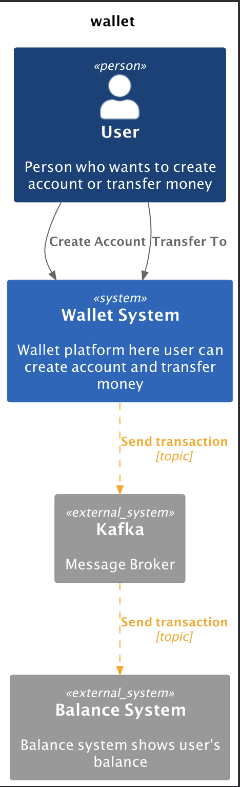

# ms-wallet



to run the project, start api

```shell
$ docker compose pull
$ docker compose build --no-cache
$ docker compose up
```

[microservice balance](https://github.com/danilobandeira29/ms-wallet-balance)

## routes

available in `./api/client.http`

### ports

- `8080` ms-wallet
- `3003` balance

```http request
#### Microservice wallet
POST http://localhost:8080/clients HTTP/1.1
Content-Type: application/json

{
"name": "Ana Banana",
"email": "ana@banana.com"
}
####


POST http://localhost:8080/accounts HTTP/1.1
Content-Type: application/json

{
"client_id": "5876bd47-1165-45a6-a9c8-f41a992f81c7"
}
####


POST http://localhost:8080/transactions HTTP/1.1
Content-Type: application/json

{
"account_id_to": "0502ee10-1536-435e-99c0-123c265e96c3",
"account_id_from": "a42582b5-9a81-4a34-a7f9-573ed825b189",
"amount": 10
}

#### Microservice balance

# verify balance "account to" in microservice balance
GET http://localhost:3003/balances/0502ee10-1536-435e-99c0-123c265e96c3 HTTP/1.1

####
# verify balance "account from" in microservice balance
GET http://localhost:3003/balances/a42582b5-9a81-4a34-a7f9-573ed825b189 HTTP/1.1


```
# TODO

- [ ] Create migration files
- [ ] Create seed files
- [ ] Uses func init to start connection with external services(kafka, databsase)
